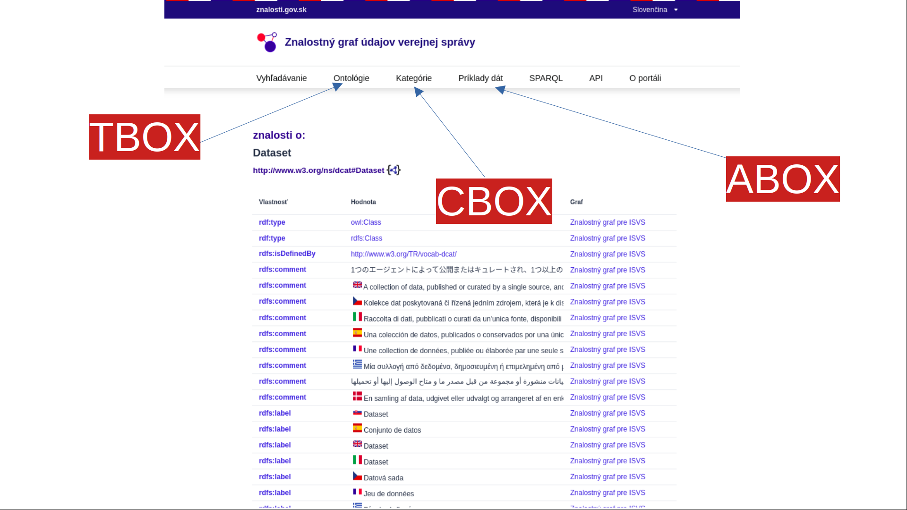

znalosti.gov.sk

Centrálny portál strojovo-spracovateľných znalostí pre informačné systémy verejnej správy.

Projekt je v súčasnosti v testovacom režime vývíjaný a prevádzkovaný [Dátovou kanceláriou](https://datalab.digital) MIRRI, a pre iný projekt je ho možné použiť pod licenciou EUPL. 
Autori portálu: [Miroslav Líška](https://www.linkedin.com/in/miroslavliska/), [Marek Šurek](https://www.linkedin.com/in/mareksurek/) 

## 3 úrovne znalostného grafu

Vyhľadávanie

## Open API 3.0 neverejná dokumentácia

Dokumentácia je chránená prístupovými údajmi

## Open API 3.0 Swagger UI neverejná dokumentácia

Dokumentácia je chránená prístupovými údajmi
