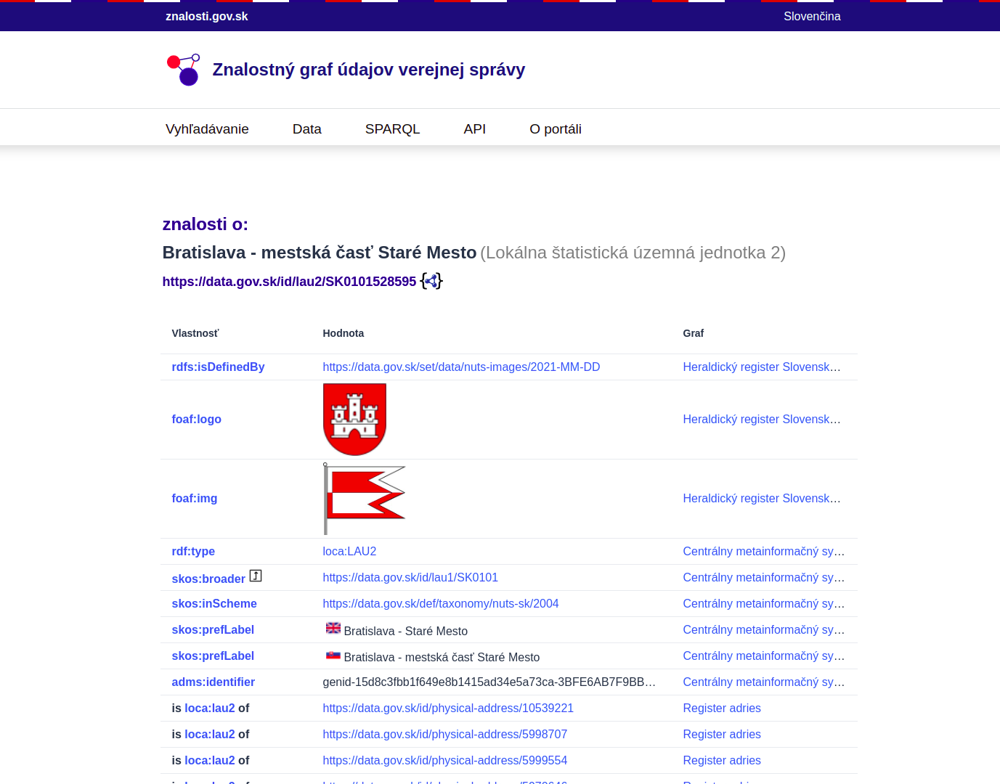

 znalosti.gov.sk

Centrálny portál strojovo-spracovateľných znalostí pre informačné systémy verejnej správy.

Projekt je v súčasnosti v testovacom režime vývíjaný a prevádzkovaný [Dátovou kanceláriou](https://datalab.digital) MIRRI, a pre iný projekt je ho možné použiť pod licenciou EUPL. 

## Screenshots

Vyhľadávanie

Znalosti o Bratislave Staré Mesto

Znalosti o MIRRI

 
SPARQL Endpoint

  
Znalosti API

Znalosti API - Príklad
